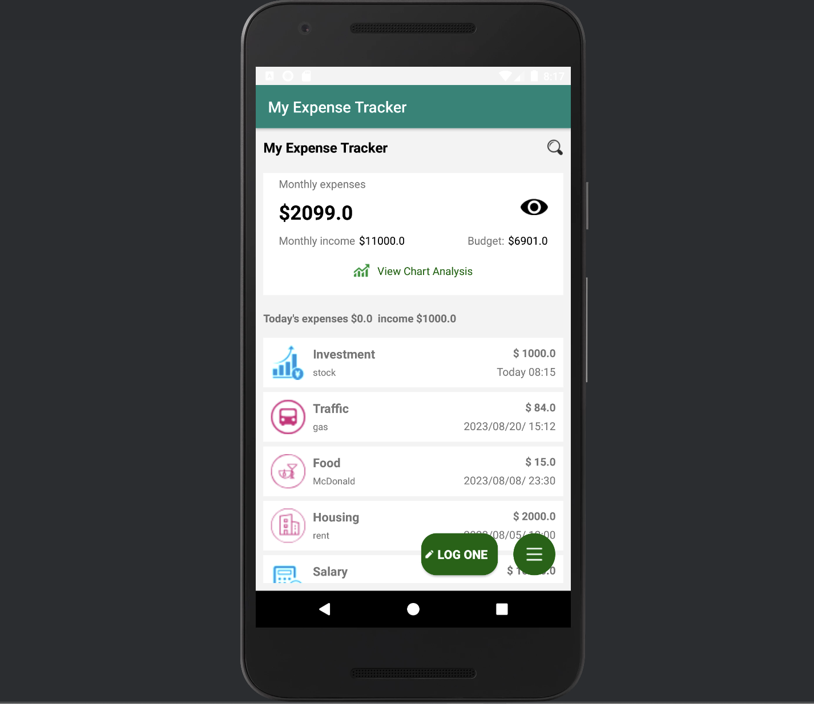
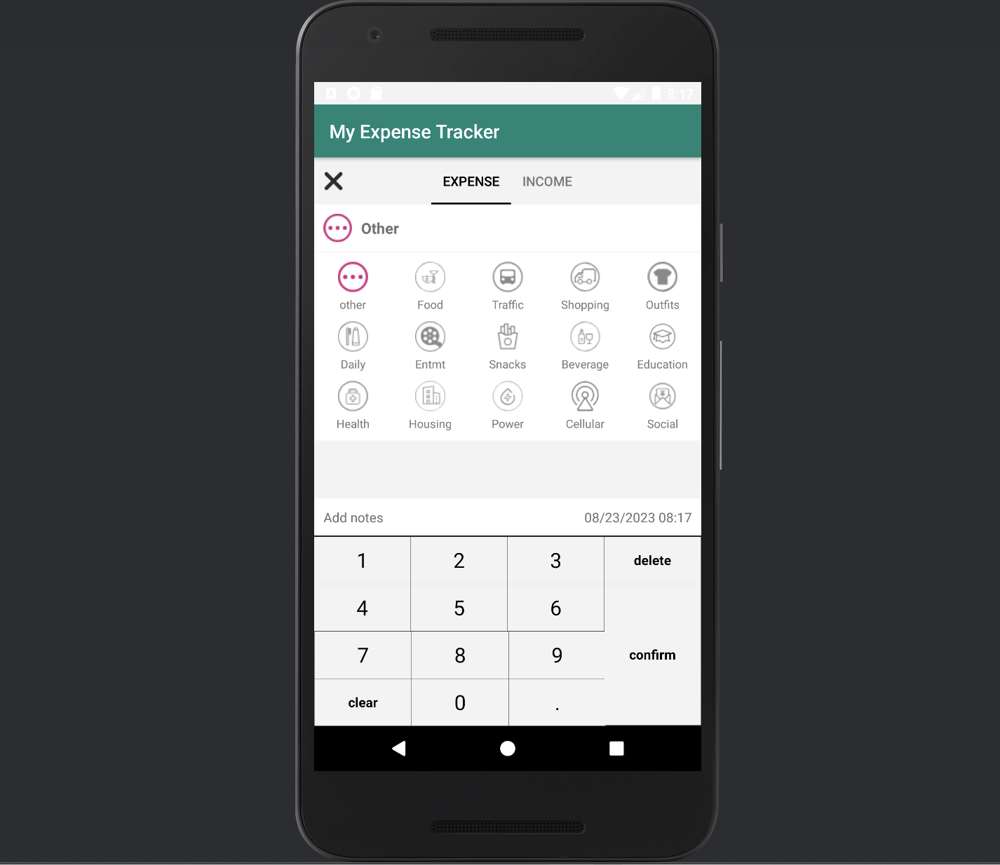
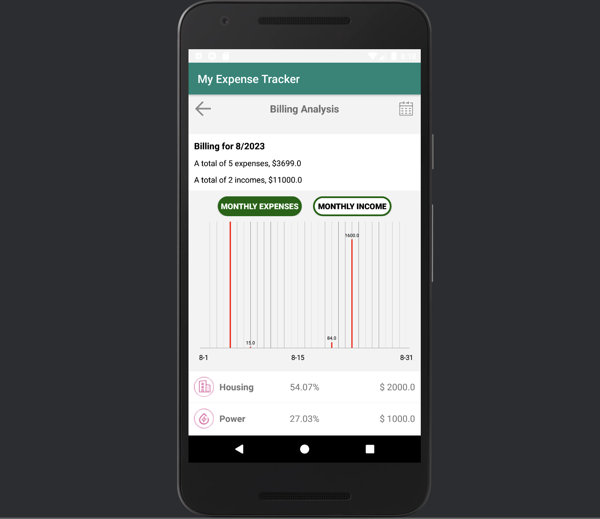
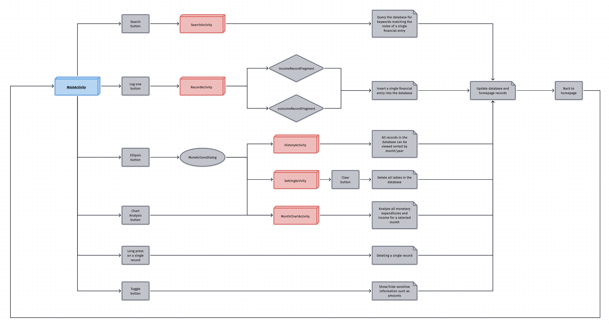

# My Expense Tracker (for Android)
* MY Expense Tracker is a comprehensive personal finance tool designed for Android, built using Java. This application offers a seamless experience for individuals looking to track and manage their daily financial activities.

- - -
## Features
* **Daily Transaction Recording:**
  * Easily log your income and expenditure.
  * View a summary of all transactions for the day.
* **Monthly Financial Overview:**
  * Get a quick look at your total income and expenses for the month.
* **Historical Bills:**
  * Browse past transactions and bills.
  * View your financial history by day, month, or custom date range.
* **Graphical Analysis:**
  * Analyze your monthly income and expenses using intuitive charts.
  * Get a visual representation of where your money is going.
* **Percentage Analysis:**
  * Understand the proportion of different types of transactions in your overall financial picture.
* **Search Functionality:**
  * Easily search for specific transactions based on user-defined keywords or categories.
  * Retrieve all income and expenditure records related to a particular keyword or category.

- - -
## Demonstrations

- - -
## Workflow
